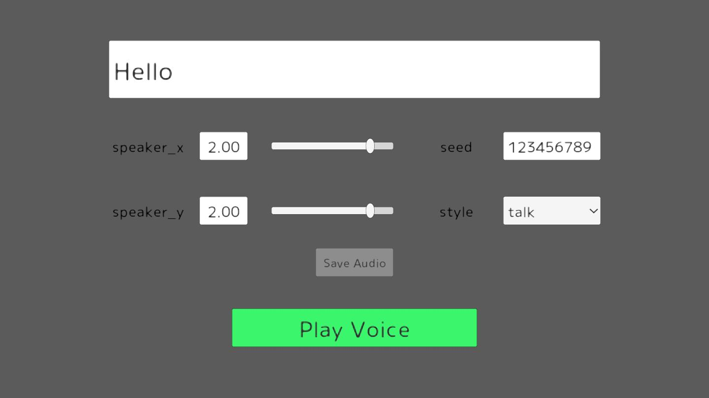

# Koeiromap Unity

Library for Unity to use Koeiromap

[日本語ドキュメント(Japanese Documents Available)](README_JP.md).
[中文文档(Chinese Document)](README_CH.md)

## Demo

You can change the parameters and play any voice on the following screen from the [demo page](https://ayutaz.github.io/koeiromap-unity/WebGL/).



<!-- START doctoc generated TOC please keep comment here to allow auto update -->
<!-- DON'T EDIT THIS SECTION, INSTEAD RE-RUN doctoc TO UPDATE -->
**Table of Contents**

- [Installation](#installation)
  - [UPM](#upm)
  - [Unity Package](#unity-package)
- [requirements](#requirements)
- [how to use](#how-to-use)
  - [Sample Code](#sample-code)
  - [Build for Windows](#build-for-windows)
- [3rd Party Notices](#3rd-party-notices)
- [License](#license)

<!-- END doctoc generated TOC please keep comment here to allow auto update -->

# Installation
## UPM
1. Open the Package Manager
2. Click the `+` button in the top left corner
3. Select `Add package from git URL...`
4. Add URL for `https://github.com/ayutaz/koeiromap-unity.git?path=Assets/KoeiromapUnity/Scripts`
5. Click `Add`

## Unity Package
1. Download the latest release from the [releases page](https://github.com/ayutaz/koeiromap-unity/releases)
2. Import the package into your project

# requirements
* Unity 2021.3.x or later
  * IL2CPP(Windows)
* [UniTask](https://github.com/Cysharp/UniTask)

# how to use

## Sample Code

``` csharp

var voiceParam = new VoiceParam
{
    text = "こんにちは",
    speaker_x = 3f,
    speaker_y = 3f,
    style = "talk",
    seed = "12345"
};
var option = new Option($"{Application.dataPath}/voice");
var voice = await KoeiromapExtensions.GetVoice(voiceParam, _token, option);
_audioSource.clip = voice.audioClip;
_audioSource.Play();

```

## Build for Windows
* Switch to Windows platform and IL2CPP

# 3rd Party Notices

See [NOTICE](NOTICE.md).

# License

[MIT License](https://github.com/ayutaz/koeiromap-unity/LICENSE)

[Font License](https://github.com/coz-m/MPLUS_FONTS/blob/master/OFL.txt)