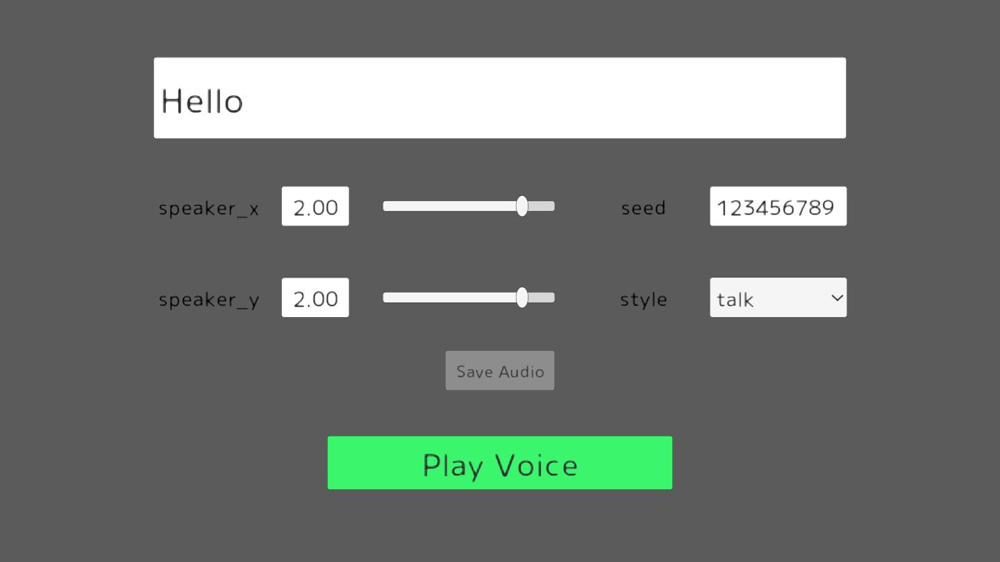

#Koeiromap Unity

适用于Unity的Koeiromap库

[英文文档](README.md)
[日文文档](README_JP.md)

## 演示

在演示页面上，您可以更改参数并播放任意语音。



<!-- START doctoc generated TOC please keep comment here to allow auto update -->
<!-- DON'T EDIT THIS SECTION, INSTEAD RE-RUN doctoc TO UPDATE -->

<!-- END doctoc generated TOC please keep comment here to allow auto update -->

# 安装

## UPM
1. 打开包管理器
2. 点击左上角的+按钮
3. 选择从git URL添加包...
4. 添加URL：https://github.com/ayutaz/koeiromap-unity.git?path=Assets/KoeiromapUnity/Scripts
5. 点击Add。

## Unity Package
1. 从发布页面下载最新版本。
2. 将包导入到项目中。

# 要求
* Unity 2021.3.x 或更高版本
  * IL2CPP（Windows）
* UniTask

# 使用方法

## 示例代码
```csharp

var voiceParam = new VoiceParam
{
    text = "こんにちは",
    speaker_x = 3f,
    speaker_y = 3f,
    style = "talk",
    seed = "12345"
};
var option = new Option($"{Application.dataPath}/voice");
var voice = await KoeiromapExtensions.GetVoice(voiceParam, _token, option);
_audioSource.clip = voice.audioClip;
_audioSource.Play();

```

## Windows版本构建
* 切换到Windows平台和IL2CPP。

# 第三方声明

请参阅[NOTICE](NOTICE.md)。

# 许可证

MIT许可证

字体许可证