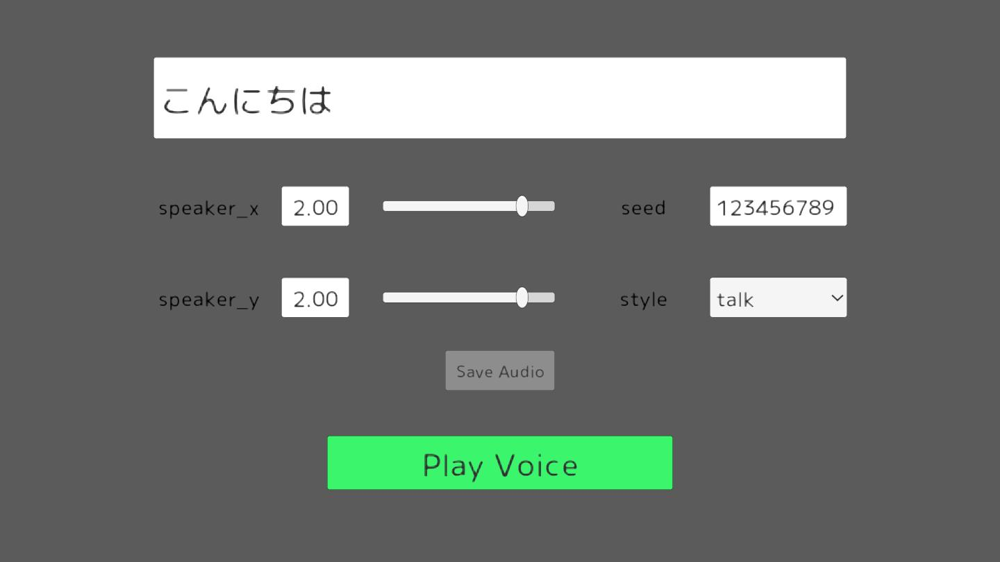

# Koeiromap Unity

Koeiromapを利用するためのUnity用ライブラリ

[English Documents Available(英語ドキュメント)](README.md)

## Demo

[デモページ](https://ayutaz.github.io/koeiromap-unity/WebGL/)から以下のような画面でパラメータを変更して、任意の声を再生することができます。



<!-- START doctoc generated TOC please keep comment here to allow auto update -->
<!-- DON'T EDIT THIS SECTION, INSTEAD RE-RUN doctoc TO UPDATE -->
**Table of Contents**

- [インストール](#%E3%82%A4%E3%83%B3%E3%82%B9%E3%83%88%E3%83%BC%E3%83%AB)
  - [UPM](#upm)
  - [Unity Package](#unity-package)
- [要件](#%E8%A6%81%E4%BB%B6)
- [使い方](#%E4%BD%BF%E3%81%84%E6%96%B9)
  - [サンプルコード](#%E3%82%B5%E3%83%B3%E3%83%97%E3%83%AB%E3%82%B3%E3%83%BC%E3%83%89)
  - [Windows 用のビルド](#windows-%E7%94%A8%E3%81%AE%E3%83%93%E3%83%AB%E3%83%89)
- [サードパーティーのお知らせ](#%E3%82%B5%E3%83%BC%E3%83%89%E3%83%91%E3%83%BC%E3%83%86%E3%82%A3%E3%83%BC%E3%81%AE%E3%81%8A%E7%9F%A5%E3%82%89%E3%81%9B)
- [ライセンス](#%E3%83%A9%E3%82%A4%E3%82%BB%E3%83%B3%E3%82%B9)

<!-- END doctoc generated TOC please keep comment here to allow auto update -->

# インストール
## UPM
1. パッケージマネージャーを開く
2. 左上にある`+`ボタンをクリックする
3. git URLからパッケージを追加...`」を選択します。
4. https://github.com/ayutaz/koeiromap-unity.git?path=Assets/KoeiromapUnity/Scripts` のURLを追加する。
5. Add`をクリックします。

## Unity Package
1. [リリースページ](https://github.com/ayutaz/koeiromap-unity/releases)から最新リリースをダウンロードする。
2. パッケージをプロジェクトにインポートする

# 要件
* Unity 2021.3.x またはそれ以降
  * IL2CPP(Windows)
* [UniTask](https://github.com/Cysharp/UniTask)

# 使い方

## サンプルコード

``` csharp

var voiceParam = new VoiceParam
{
    text = "こんにちは",
    speaker_x = 3f,
    speaker_y = 3f,
    style = "talk",
    seed = "12345"
};
var option = new Option($"{Application.dataPath}/voice");
var voice = await KoeiromapExtensions.GetVoice(voiceParam, _token, option);
_audioSource.clip = voice.audioClip;
_audioSource.Play();

```

## Windows 用のビルド
* WindowsプラットフォームとIL2CPPに切り替える

# サードパーティーのお知らせ

[NOTICE](https://github.com/ayutaz/koeiromap-unity/NOTICE.md)をご参照ください。

# ライセンス

[MITライセンス](https://github.com/ayutaz/koeiromap-unity/LICENSE)

[Font License](https://github.com/coz-m/MPLUS_FONTS/blob/master/OFL.txt)